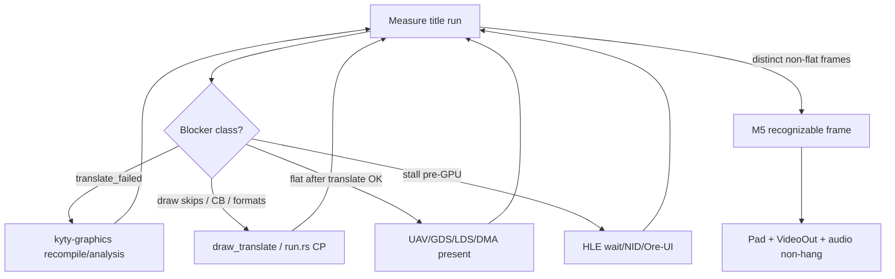

# From Shader Translation to PS5-like Play

**Date:** 2026-07-20  
**North star title:** ASTRO.BOT (graphics proof); Minecraft / Until Dawn as secondary evidence  
**Related:** [2026-07-18-astro-bot-recognizable-frame.md](2026-07-18-astro-bot-recognizable-frame.md)

**Honest scope:** Full “runs like a PS5 on PC” is M4–M5+ (menus, saves, audio, pad, many titles). Do **not** treat the Kyty recompiler as the whole product. Shader work is necessary but not sufficient — ASTRO’s scene is compute-dominated, and several titles stall in HLE before GPU.

---

## Checklist

- [ ] Fresh ASTRO `translate_failed` / `draw_skip` / frame-histogram enumeration
- [ ] Fix highest-count remaining kyty-graphics translate reason + unit test
- [ ] Implement `R_DMA_DATA` / `IT_COPY_DATA` execution in GraphicsRun CP
- [ ] Harden UAV/GDS/LDS → later draw/composite data path; re-measure flat colour
- [ ] Fix CB `0x3` attachment/blend/export safely before re-enabling map
- [ ] Capture non-splash recognizable ASTRO frame; document remaining gaps
- [ ] Only after M5 entry: Minecraft Ore-UI / zero-draw bisect; UE condvar stalls

---

## Operating rule (every session)

1. Bounded release run of one title (`--run-eboot`, dump shaders/frames).
2. Classify the **first** named blocker (translate / CB format / DMA / stall / zero pixels).
3. Fix **only that class** with a regression test.
4. Re-measure: `translate_failed`, `draw_skips`, frame histogram (`distinct_pixels`), not splash.

Do not delete `crates/raeen-gpu/src/shader/` unless you want cleanup; it is not on this path. Live path: `shader_fetch.rs` → `kyty-graphics` shader/ → `draw_translate.rs`.

---

## Phase A — Close remaining shader translation gaps (title-measured)

Goal: `translate_failed → 0` (or named, bounded skips) on ASTRO’s scene compute + draw shaders.

Work in `crates/kyty-graphics/src/shader/{recompile,parse,analysis,spirv}.rs`:

1. **Re-enumerate failures after each fix** (`enumerate_dumps` / run logs). Post-EUD list is stale once LDS/MUBUF land in-tree; trust the latest profile.
2. **Wire remaining `G_RECOMP_FUNC` NI rows** (9 left) only when a dump hits them — plus any staged `#[allow(dead_code)]` recompilers that dumps already need.
3. **Keep beyond-Kyty features honest:** flexible MUBUF, LDS + barriers, usage `0x05`, POS1/clip exports — each needs a unit test + ASTRO re-measure (flexible addressing can regress Minecraft’s working buffer path).
4. **RDNA2 end / multi-block parse:** preserve `s_code_end` semantics; never “trim the buffer” as a substitute.
5. **Acceptance:** naga validate in tests; title run shows scene CS/PS in `translated_ok` with named skips only.

---

## Phase B — Make translated shaders affect the presented image

ASTRO’s 3D path is **compute → storage/HDR resources → composite draw**. Translation alone still yields flat colour if data never flows.

1. **CP DMA / copy** — implement consumption of `R_DMA_DATA` / `IT_COPY_DATA` in `crates/kyty-graphics/src/run.rs` (builders already exist in HLE; CP still skips by length). This is the top candidate for scanout/composite fill.
2. **Storage-image / UAV fidelity** — beyond RGBA8 reinterpret: correct formats, graphics-stage storage if measured, **no silent re-tile skip** on writeback (`crates/raeen-gpu/src/vulkan/compute.rs`, `draw_translate.rs`).
3. **GDS / LDS persistence** across dispatches (tests exist; prove on title).
4. **CB colour formats safely** — format `0x3` (8_8) caused `VK_ERROR_DEVICE_LOST`; fix attachment/blend/export mismatch **before** re-enabling the map (keep the reject-assert until then).
5. **Texture / tile / sampler gaps** — only when dumps name them; keep sampled vs storage T# split.
6. **Acceptance:** frame dumps leave splash; histogram shows **changing, non-flat** pixels (not `distinct_pixels=1`).

---

## Phase C — Present path and interactive shell (M3-shaped)

1. VideoOut flip → real present (swapchain), not only offscreen/PPM.
2. Pad → `libScePad` observable input.
3. Audio stubs must not hang boot (ASTRO already parks on audio event flags — keep fail-soft).
4. Shell launch stays on `execute_process` / normal init (no env-var workarounds for correctness).

---

## Phase D — Title-specific non-shader blockers (parallel evidence, don’t confuse with GPU)

| Title | Measured gate | Action class |
|-------|---------------|--------------|
| **ASTRO.BOT** | Flat composite / scene compute | Phases A–B |
| **Minecraft** | Ore-UI never loads HTML; many draws write **zero** | HLE Gameface page handoff + one real draw’s V# dump (format/offset/Y-flip) — **not** more opcode coverage first |
| **Until Dawn / DB** | Condvar starvation pre-RHI | Trace who signals; fix wait/wake — GPU unused until then |

Implement NIDs **only on measured call**, not the full static unresolved set.

---

## Phase E — Toward “feels like PS5” (after first recognizable frame)

1. Document known glitches; keep crash logs NID/GPU-useful (M4/M5 honesty).
2. Save-data host map; entitlement/dialog stubs only if a title **calls** them.
3. Broaden second title once ASTRO has a recognizable frame.
4. Do **not** revive the old `raeen-gpu` IR emitter for titles — extend Kyty path only.

---

## What you do this week (concrete order)

1. ASTRO bounded run + dump: list current `translate_failed` reasons (fresh enumeration).
2. Fix the **highest-count** remaining translate reason with a test; re-run.
3. Implement CP `DMA_DATA`/`COPY_DATA` execution; re-check scanout/composite.
4. Re-measure frame histogram; if still flat, bisect compute writeback (UAV/GDS) vs skipped CS.
5. Only then touch CB `0x3` with a full attachment+blend+export fix plan.
6. Keep Minecraft as a **regression** after any MUBUF/addressing change; don’t chase its menu until ASTRO leaves flat colour **or** you explicitly switch north star.

---

## Success ladder (claim only with proof)

| Claim | Proof |
|-------|--------|
| Shader translator improved | Dump reason count down; table/tests green |
| Homebrew / M2 | Already closed — don’t re-prove |
| Recognizable 3D (M5 entry) | Screenshot/PPM of ASTRO scene, not splash/flat |
| Interactive | Pad changes frame or title state |
| “Like PS5” | Multiple titles to menu/play — far after M5 |

The 2026-07-18 ASTRO plan’s slices 1–2 are largely done; graphics slices (scene shaders, compute-image coherence, presentation) still apply.
