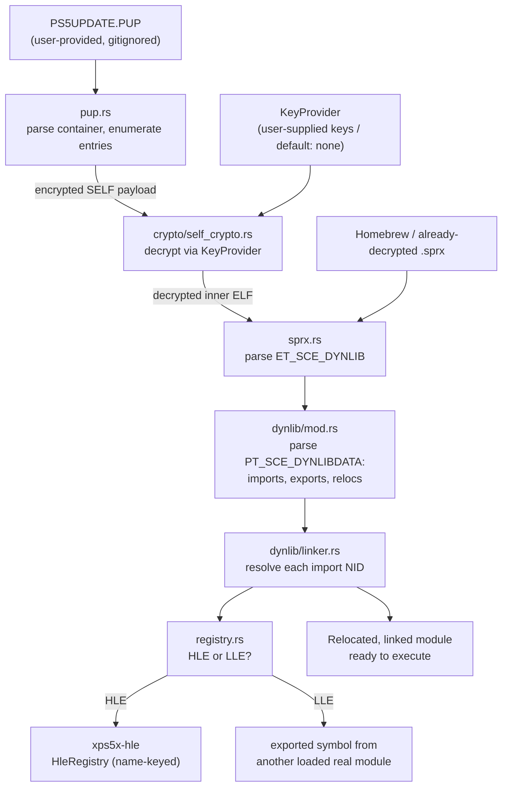

# XPS5X — LLE Firmware Spine Design

**Date:** 2026-07-12
**Status:** Approved (design), pending implementation plan
**Scope of this spec:** The "firmware spine" — the subsystem that ingests PS5 firmware, decrypts it through a user-supplied key boundary, loads Sony's real userland modules, and links them by NID against either real modules (LLE) or XPS5X's reimplementations (HLE). Target milestones **LM0 → LM1** (see roadmap).

---

## 1. Goal & Context

### 1.1 What changed

The original [implementation_plan.md](../../../implementation_plan.md) describes a pure **HLE** emulator: it re-implements Sony's `.sprx` libraries so it never needs the firmware. The user's goal is different — they want to **run Sony's real firmware** to get the genuine PS5 experience.

After brainstorming, the agreed direction is **LLE userland on an HLE kernel** (the RPCS3 model):

- **Keep** the HLE Orbis kernel (`xps5x-kernel`) — syscalls, memory, threading, VFS are still reimplemented.
- **Add** the ability to load and execute Sony's **real userland modules** (`.sprx`) extracted from the firmware.
- **Per-module choice:** each imported symbol resolves to either Sony's real code (LLE) or XPS5X's reimplementation (HLE), toggled by config.

This does not discard existing work. The loader, kernel, GPU stack, and HLE stubs all remain and are consumed by the new layer. LLE is an *additive* layer, not a rewrite.

### 1.2 Non-goals for this spec

- Full-kernel LLE (running the decrypted Orbis kernel binary, secure-processor/hypervisor emulation). Explicitly out of scope; a separate future research track.
- Booting the actual PS5 shell. That is the multi-year north star (LM3+), not this slice.
- Any key extraction, jailbreak, glitching, side-channel, or DRM-circumvention tooling. See §2.

---

## 2. The Blocker & The Clean-Room Boundary

This is recorded explicitly so the constraint is never lost.

**Decrypting retail firmware is blocked and stays blocked in this project.** PS5 module/SELF payloads are encrypted with keys fused into the console's dedicated security processor. They are never exposed to the main CPU, and there is **no public method** to extract them or decrypt arbitrary PS5 firmware — unlike the PS3 (key leak, 2010) or early PS4 firmware. The ciphers themselves (AES-class) are not brute-forceable.

**Design consequences — non-negotiable:**

1. **XPS5X ships no keys, no firmware, and no key-extraction/circumvention tooling.** The repository never contains Sony keys or firmware blobs. (`PS5 Firmware/` is already `.gitignore`d.)
2. **Decryption happens only through a `KeyProvider` that the user supplies**, from keys they obtained from hardware they own — mirroring how RPCS3/Dolphin consume user-dumped firmware. The default provider returns "no keys" and decryption fails cleanly.
3. **The spine is developed and tested against homebrew and any modules the user can already decrypt.** Development never stalls on the crypto wall; real modules flow through the instant a valid `KeyProvider` is present.

The `KeyProvider` interface is the hard stop. XPS5X implements everything on the *emulator* side of that seam and nothing on the *attack* side of it.

---

## 3. Architecture

### 3.1 New crate: `xps5x-firmware`

The spine is distinct from plain binary parsing and gets its own crate. It depends on `xps5x-loader` (ELF/SELF primitives) and `xps5x-core` (errors, types), and is consumed by `xps5x-hle` (module registry) and, later, the runtime/GUI.

```
crates/xps5x-firmware/
├── Cargo.toml
└── src/
    ├── lib.rs           # Public API: Firmware, ModuleLoader, ModuleRegistry
    ├── pup.rs           # PUP (PlayStation Update Package) container parser
    ├── crypto/
    │   ├── mod.rs       # KeyProvider trait, KeySet, no-keys default provider
    │   └── self_crypto.rs  # SELF segment decryption machinery (driven by KeyProvider)
    ├── sprx.rs          # .sprx / ET_SCE_DYNLIB module parser
    ├── dynlib/
    │   ├── mod.rs       # PT_SCE_DYNLIBDATA parser (import/export/reloc tables)
    │   ├── nid.rs       # NID hashing + NID→name resolution database
    │   └── linker.rs    # NID-based dynamic linker / relocation applier
    └── registry.rs      # ModuleRegistry: per-(module,NID) HLE-vs-LLE dispatch
```

### 3.2 Data flow



### 3.3 Components

#### 3.3.1 `pup.rs` — PUP parser

- Parse the PUP container structure to the extent it is unencrypted: outer header (magic, version), the entry/segment table, and per-entry metadata (id, offset, size, flags).
- Enumerate contents; classify entries (system modules, kernel blobs, metadata) by known id ranges where possible.
- Hand encrypted payloads to the crypto layer; never attempt to defeat encryption.
- Public surface: `Firmware::open(path) -> Result<Firmware>`, `Firmware::entries() -> &[PupEntry]`, `Firmware::read_entry(&PupEntry) -> Result<Vec<u8>>` (returns raw/encrypted bytes; decryption is a separate explicit step).
- Drives the `xps5x --firmware-info <PUP>` diagnostic (LM0 acceptance).

#### 3.3.2 `crypto/` — KeyProvider seam + SELF decryption

- **`KeyProvider` trait:** supplies content keys/IVs for a given SELF/module identity (key type, key id/seed from the SELF metadata). Signature (approximate):
  ```rust
  pub trait KeyProvider: Send + Sync {
      fn segment_key(&self, req: &KeyRequest) -> Option<SegmentKey>;
  }
  ```
- **Default `NoKeysProvider`:** returns `None` for everything → decryption yields `LoaderError::EncryptedSelf` (reuses the existing error; see [self_format.rs:161](../../../crates/xps5x-loader/src/self_format.rs)).
- **User-supplied provider:** loads a `keys.toml`/keyfile the user points to. Not committed; documented format only.
- **`self_crypto.rs`:** implements the SELF segment decryption *machinery* (the algorithm shape is community-documented; only the keys are secret). Given a decrypted-or-not SELF and a `KeyProvider`, it produces the plaintext inner ELF, or a clean error if keys are unavailable. This replaces the current hard `EncryptedSelf` bail with: *route encrypted segments through the provider; error only if the provider has no key.*
- **Boundary reaffirmed:** this module consumes keys; it never derives, guesses, brute-forces, or extracts them.

#### 3.3.3 `sprx.rs` — module parser

- Parse Sony modules (`ET_SCE_DYNLIB` = `0xFE18`, and dynamic execs `ET_SCE_DYNEXEC` = `0xFE10`). The existing ELF parser already *recognizes* these types and the SCE program-header types but only logs them ([elf.rs:74-85](../../../crates/xps5x-loader/src/elf.rs), [elf.rs:122-133](../../../crates/xps5x-loader/src/elf.rs)).
- Locate and hand `PT_SCE_DYNLIBDATA` (`0x61000000`) and `PT_SCE_PROCPARAM`/`PT_SCE_MODULE_PARAM` to the `dynlib` parser.
- Produce a `Module { name, segments, dynlib_data, export_table, import_table, relocations }`.

#### 3.3.4 `dynlib/` — Sony dynamic-linking data + NID linker

Sony does **not** use standard ELF symbol names for imports/exports. It replaces them with **NIDs**: `NID = base64( first 8 bytes of SHA-1( symbol_name + fixed_secret_suffix ) )`. Imports/exports live in `PT_SCE_DYNLIBDATA` (a fingerprinted symbol table + string table + its own relocation tables), *not* in a normal `.dynsym`. `goblin`'s generic `.libraries`/`.soname` path (used today) does not decode these correctly.

- **`mod.rs`:** parse `PT_SCE_DYNLIBDATA` — the SCE dynamic tags, the encoded module/library id lists, the export and import fingerprint tables, and the SCE relocation tables (`jmprel`/`rela`).
- **`nid.rs`:**
  - Compute NIDs from symbol names (the hash above), enabling a **name↔NID database**.
  - Build the resolution database: for every symbol XPS5X implements in HLE (known by name), precompute its NID so imports-by-NID resolve to HLE functions with no per-symbol hand-mapping.
  - Include a seed table of well-known module/library NIDs.
- **`linker.rs`:** for each import, look up its target via the `ModuleRegistry`, then apply the module's SCE relocations to patch the resolved address into the GOT/import slots. Handles the standard relocation types Sony emits.

#### 3.3.5 `registry.rs` — HLE/LLE dispatch

The heart of "LLE userland on HLE kernel."

- `ModuleRegistry` maps `(module_name_or_nid, symbol_nid)` → `Resolver`, where `Resolver` is one of:
  - `Hle(HleFunction)` — bridged to the existing name-keyed `HleRegistry` in `xps5x-hle` via the NID→name database.
  - `Lle(ExportAddr)` — an exported symbol address from another loaded real module.
  - `Unresolved` — logged; returns a diagnostic stub address so execution can proceed/trap deliberately.
- **Per-module policy:** config declares, per module (e.g. `libkernel`, `libSceGnmDriver`), whether to prefer HLE or LLE. Default: **HLE for everything** (works today), LLE opt-in per module as real modules become loadable.
- Bridges to `xps5x-hle::HleRegistry` (see [lib.rs:41](../../../crates/xps5x-hle/src/lib.rs)) — the registry does not duplicate HLE implementations, it routes to them.

### 3.4 Error handling

- Extend `LoaderError` (or add a sibling `FirmwareError` in `xps5x-core::error`) with: `InvalidPupMagic`, `PupEntryOutOfBounds`, `MissingKey { key_id }`, `UnsupportedRelocation(u32)`, `MalformedDynlibData(String)`.
- `EncryptedSelf` is retained but demoted: it now specifically means "encrypted and no key available," raised from `crypto` rather than from `self_format` directly.
- Decryption failure due to missing keys is a **normal, expected, non-fatal** condition (the default path), logged at `info`, not `error`.

---

## 4. Milestone Roadmap (LLE reframe)

| ID | Target | Keys needed? |
|:---|:---|:---|
| **LM0** | `xps5x --firmware-info <PUP>` enumerates firmware contents; `KeyProvider` seam wired; default no-keys path is clean | No |
| **LM1** | A homebrew / already-decrypted `.sprx` loads through the full pipeline (SELF → decrypt-or-passthrough → ELF → dynlib parse → NID link → registry) and executes, with imports resolved to HLE stubs | No |
| **LM2** | HLE kernel fidelity sufficient to initialize a real (user-decrypted) low-level system module | Keys |
| **LM3+** | Module load-order boot chain → `SceShellCore` → compositor → PS5 home screen | Keys + years |

**This spec covers LM0 → LM1.** LM2+ are recorded for direction only.

---

## 5. First Implementation Slice (LM0 → LM1)

Buildable now, no keys required:

1. **Scaffold `xps5x-firmware` crate**; add to workspace members; wire `xps5x-core` + `xps5x-loader` deps.
2. **`pup.rs`** — PUP container parser + `Firmware` API.
3. **CLI diagnostic** — `--firmware-info` prints the parsed structure of the user's `PS5 Firmware/PS5UPDATE.PUP`. *(LM0 acceptance.)*
4. **`crypto/`** — `KeyProvider` trait, `NoKeysProvider` default, `self_crypto` decryption machinery; refactor `self_format::parse_self` to route encrypted segments through the provider instead of hard-failing.
5. **`sprx.rs` + `dynlib/`** — parse `ET_SCE_DYNLIB` and `PT_SCE_DYNLIBDATA` into import/export/relocation tables.
6. **`dynlib/nid.rs`** — NID hashing + name↔NID database, seeded from HLE function names.
7. **`registry.rs` + `dynlib/linker.rs`** — `ModuleRegistry` with HLE/LLE dispatch, bridged to `xps5x-hle::HleRegistry`; relocation application.
8. **End-to-end test** — a homebrew/decrypted `.sprx` loads, links against HLE stubs, and runs (or reaches a defined entry state). *(LM1 acceptance.)*

---

## 6. Verification Plan

### Automated (`cargo test --workspace`)
- **PUP parser:** synthetic PUP headers → correct entry enumeration; malformed → correct errors. (No real firmware bytes in tests.)
- **Crypto seam:** `NoKeysProvider` → `EncryptedSelf`; a stub provider with a known test key round-trips a synthetic encrypted-segment SELF.
- **NID:** known `name → NID` vectors from public documentation; name↔NID database round-trips for all HLE-registered functions.
- **Dynlib parser:** hand-built `PT_SCE_DYNLIBDATA` blobs → correct import/export/reloc tables.
- **Linker/registry:** an import NID resolves to the correct HLE function; per-module HLE/LLE policy is honored; relocations patch the expected slots.

### Manual
- **LM0:** run `xps5x --firmware-info "PS5 Firmware/PS5UPDATE.PUP"`; verify it enumerates entries and reports encrypted payloads as such without crashing and without attempting decryption.
- **LM1:** load a homebrew/decrypted `.sprx`; verify it links and reaches its defined entry state; verify unresolved imports are logged, not fatal.

### Guardrails
- CI/grep check that no key material or firmware blobs are committed.
- Clippy + rustfmt across the new crate.

---

## 7. Open Items (deferred, not blocking)

- Exact PS5 PUP inner layout beyond the outer container (community RE-dependent; parse-what's-readable now, extend later).
- Full SCE relocation-type coverage (implement the common set for LM1; extend as real modules exercise more).
- `keys.toml` format finalization (documented at implementation time; user-supplied only).
