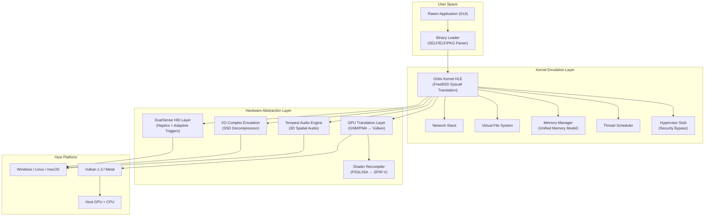
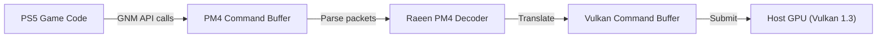
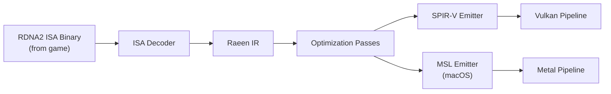

# Raeen — PlayStation 5 Emulator / Compatibility Layer

A cross-platform PS5 emulation environment that loads PS5 firmware and game binaries, translates system calls and GPU commands in real-time, and runs PS5 titles on Windows, Linux, and macOS using the host machine's bare-metal hardware.

---

## Background & Feasibility

The PS5 uses an **x86-64 Zen 2 CPU** — the same instruction set as desktop PCs. This means Raeen does **not** need a CPU interpreter/JIT (unlike PS3's Cell). Instead, it operates as a **compatibility layer** (similar to Wine/Proton or shadPS4 for PS4) that:

1. **Natively executes** PS5 x86-64 game code on the host CPU
2. **Translates** Sony's proprietary OS calls (FreeBSD-derived Orbis OS) to host OS equivalents
3. **Translates** Sony's proprietary GPU commands (GNM/GNMX → Vulkan/Metal)
4. **Emulates** custom hardware subsystems (Tempest 3D Audio, I/O Complex, DualSense)

### PS5 Hardware Reference

| Component | Specification |
|:---|:---|
| CPU | Custom 8-core AMD Zen 2, up to 3.5 GHz (variable freq) |
| GPU | Custom RDNA 2, 36 CUs @ 2.23 GHz, 10.28 TFLOPS |
| RAM | 16 GB GDDR6, 256-bit, 448 GB/s |
| Storage | Custom 825 GB NVMe SSD, 5.5 GB/s raw (8-9 GB/s compressed) |
| Audio | Tempest Engine (dedicated 3D audio processing unit) |
| Graphics API | GNM (low-level) / GNMX (high-level wrapper) |
| Shader Language | PSSL (PlayStation Shader Language, HLSL-like) |
| OS | Orbis OS (heavily modified FreeBSD) |
| Executable Format | SELF (Signed ELF), PKG containers |

---

## User Review Required

> [!CAUTION]
> **Legal Disclaimer**: PS5 firmware, game binaries, and SDK materials are proprietary to Sony Interactive Entertainment. This project must be developed through **clean-room reverse engineering** — never using leaked SDK code, copyrighted firmware blobs in the repository, or circumvention tools. Users must legally obtain their own firmware dumps and game files from consoles they own.

> [!IMPORTANT]
> **Scope Reality Check**: This is a multi-year, team-scale project. The plan below bootstraps a **foundational architecture** that can progressively add capabilities. The initial milestone targets booting the PS5 shell / running simple homebrew, NOT playing AAA titles. Each phase builds on the last.

> [!WARNING]
> **Language Choice**: The plan proposes **Rust** as the primary language (with C/C++ FFI for Vulkan/platform interop). Rust's memory safety is critical for an emulator managing complex concurrent state (GPU command streams, kernel threads, memory mapping). If you prefer C++ (which has more emulator precedents), say so and I'll adjust.

---

## Open Questions

1. **Language**: Rust (recommended for safety + modern tooling) or C++ (more emulator precedents)?
2. **GPU Backend Priority**: Vulkan-first (Windows + Linux) with Metal planned for macOS? Or target all three from day one?
3. **Firmware Loading**: Should Raeen attempt to load actual PS5 firmware modules (`.sprx` libraries), or re-implement them from scratch (cleaner legally, harder technically)?
4. **Licensing**: GPLv2 (like shadPS4), GPLv3, MIT, or proprietary?
5. **Build System**: Cargo (Rust) / CMake (C++) / Meson?

---

## Architecture Overview



---

## Proposed Changes

### Phase 0 — Project Scaffolding & Build System

#### [NEW] Project Root Structure

```
r:\Projects\Raeen\
├── Cargo.toml                  # Workspace manifest
├── README.md                   # Project overview
├── LICENSE
├── .gitignore
├── docs/
│   ├── architecture.md         # This document (expanded)
│   ├── gpu-translation.md      # GNM→Vulkan design notes
│   └── syscall-table.md        # Orbis syscall mapping reference
├── crates/
│   ├── raeen-core/             # Core emulator engine
│   │   ├── Cargo.toml
│   │   └── src/
│   │       ├── lib.rs
│   │       ├── config.rs       # Runtime configuration
│   │       └── error.rs        # Error types
│   ├── raeen-loader/           # SELF/ELF/PKG binary loader
│   │   ├── Cargo.toml
│   │   └── src/
│   │       ├── lib.rs
│   │       ├── elf.rs          # ELF parser
│   │       ├── self_format.rs  # SELF (Signed ELF) parser
│   │       └── pkg.rs          # PKG container parser
│   ├── raeen-kernel/           # Orbis OS kernel HLE
│   │   ├── Cargo.toml
│   │   └── src/
│   │       ├── lib.rs
│   │       ├── syscalls/       # Syscall handlers
│   │       │   ├── mod.rs
│   │       │   ├── file.rs     # File I/O syscalls
│   │       │   ├── memory.rs   # mmap, munmap, mprotect
│   │       │   ├── thread.rs   # pthread, futex
│   │       │   ├── process.rs  # fork, exec, exit
│   │       │   └── network.rs  # Socket operations
│   │       ├── memory/         # Memory management
│   │       │   ├── mod.rs
│   │       │   ├── virtual_memory.rs
│   │       │   ├── physical_memory.rs
│   │       │   └── gpu_memory.rs  # Unified GARLIC/ONION model
│   │       ├── threading/      # Thread & scheduling
│   │       │   ├── mod.rs
│   │       │   ├── scheduler.rs
│   │       │   └── sync.rs     # Mutexes, semaphores, events
│   │       ├── filesystem/     # Virtual FS
│   │       │   ├── mod.rs
│   │       │   └── vfs.rs
│   │       └── hypervisor.rs   # HV stub (security passthrough)
│   ├── raeen-gpu/              # GPU command translation
│   │   ├── Cargo.toml
│   │   └── src/
│   │       ├── lib.rs
│   │       ├── gnm/            # GNM API re-implementation
│   │       │   ├── mod.rs
│   │       │   ├── command_buffer.rs   # PM4 packet parser
│   │       │   ├── draw.rs             # Draw call translation
│   │       │   ├── compute.rs          # Compute dispatch
│   │       │   ├── memory.rs           # GPU memory ops
│   │       │   └── registers.rs        # Hardware register state
│   │       ├── shader/         # Shader recompiler
│   │       │   ├── mod.rs
│   │       │   ├── gcn_decoder.rs      # GCN/RDNA2 ISA decoder
│   │       │   ├── ir.rs               # Intermediate representation
│   │       │   ├── spirv_emitter.rs    # SPIR-V code generation
│   │       │   └── cache.rs            # Shader cache
│   │       ├── vulkan/         # Vulkan backend
│   │       │   ├── mod.rs
│   │       │   ├── instance.rs
│   │       │   ├── device.rs
│   │       │   ├── swapchain.rs
│   │       │   ├── pipeline.rs
│   │       │   ├── command.rs
│   │       │   └── memory.rs
│   │       └── texture/        # Texture format translation
│   │           ├── mod.rs
│   │           ├── formats.rs
│   │           └── tiling.rs   # PS5 tiling modes → linear
│   ├── raeen-audio/            # Tempest 3D audio emulation
│   │   ├── Cargo.toml
│   │   └── src/
│   │       ├── lib.rs
│   │       ├── tempest.rs      # Spatial audio processing
│   │       ├── hrtf.rs         # Head-Related Transfer Functions
│   │       └── output.rs       # Host audio output (WASAPI/PulseAudio/CoreAudio)
│   ├── raeen-io/               # I/O complex & storage emulation
│   │   ├── Cargo.toml
│   │   └── src/
│   │       ├── lib.rs
│   │       ├── ssd.rs          # SSD speed emulation
│   │       ├── decompression.rs # Kraken/Oodle decompression
│   │       └── dma.rs          # DMA transfer emulation
│   ├── raeen-input/            # Controller / HID
│   │   ├── Cargo.toml
│   │   └── src/
│   │       ├── lib.rs
│   │       ├── dualsense.rs    # DualSense protocol
│   │       ├── haptics.rs      # Haptic feedback translation
│   │       └── adaptive_triggers.rs
│   ├── raeen-hle/              # High-Level Emulation of system libraries
│   │   ├── Cargo.toml
│   │   └── src/
│   │       ├── lib.rs
│   │       ├── libc.rs         # PS5 libc re-implementation
│   │       ├── libkernel.rs    # libkernel.sprx
│   │       ├── libSceGnmDriver.rs    # Graphics driver
│   │       ├── libSceVideoOut.rs     # Video output
│   │       ├── libSceAudioOut.rs     # Audio output
│   │       ├── libScePad.rs          # Controller input
│   │       ├── libSceNet.rs          # Networking
│   │       ├── libSceSaveData.rs     # Save data management
│   │       └── libSceSysmodule.rs    # Module loader
│   └── raeen-gui/              # Desktop application / GUI
│       ├── Cargo.toml
│       └── src/
│           ├── main.rs         # Entry point
│           ├── app.rs          # Application state
│           ├── game_list.rs    # Game library browser
│           ├── settings.rs     # Configuration UI
│           └── debug/          # Debug tools
│               ├── mod.rs
│               ├── gpu_debugger.rs
│               ├── memory_viewer.rs
│               └── log_viewer.rs
└── tests/
    ├── integration/
    └── test_roms/              # Homebrew test binaries
```

---

### Phase 1 — Binary Loader & Memory Manager (Weeks 1–4)

The absolute foundation. Without this, nothing runs.

#### [NEW] [Cargo.toml](file:///r:/Projects/Raeen/Cargo.toml)
Rust workspace manifest defining all crates and shared dependencies (ash for Vulkan, winit for windowing, etc.).

#### [NEW] `crates/raeen-loader/` — Binary Loader
- Parse PS5 ELF binaries (standard ELF64 with Sony extensions)
- Parse SELF (Signed ELF) headers — strip Sony signature envelope, extract inner ELF
- Parse PKG containers — extract game data files, metadata, and executables
- Load program segments into virtual memory at correct addresses
- Handle dynamic linking / relocation of `.sprx` modules (PS5's shared libraries)

#### [NEW] `crates/raeen-kernel/src/memory/` — Memory Manager
- Implement virtual address space emulation (PS5 uses a flat 48-bit virtual address space)
- Map PS5's unified memory model to host memory:
  - **GARLIC** memory (GPU-accessible, cached) → mapped to GPU-visible host memory
  - **ONION** memory (CPU-accessible, uncached by GPU) → standard host allocations
- Support `mmap`, `munmap`, `mprotect` translations
- Guard page protection and fault handling

#### [NEW] `crates/raeen-core/` — Core Engine
- Configuration loading (TOML-based config files)
- Logging infrastructure (tracing crate)
- Error types and result handling

---

### Phase 2 — Kernel HLE & System Call Translation (Weeks 5–10)

The PS5's Orbis OS is a modified FreeBSD. Games don't call raw syscalls — they call Sony's userland libraries (`libkernel.sprx`, `libc.sprx`), which internally use FreeBSD-style syscalls with custom extensions.

#### [NEW] `crates/raeen-kernel/src/syscalls/` — Syscall Dispatch

Implement a syscall dispatcher that intercepts x86-64 `syscall` instructions and routes them:

| Orbis Syscall | FreeBSD Equivalent | Host Translation |
|:---|:---|:---|
| `sys_open` | `open(2)` | `CreateFileW` (Win) / `open` (POSIX) |
| `sys_read/write` | `read(2)/write(2)` | Direct translation |
| `sys_mmap` | `mmap(2)` | `VirtualAlloc` (Win) / `mmap` (POSIX) |
| `sys_ioctl` | `ioctl(2)` | Device-specific handling |
| `sys_thr_new` | `thr_new(2)` | `CreateThread` (Win) / `pthread_create` (POSIX) |
| `sys_nanosleep` | `nanosleep(2)` | `Sleep` (Win) / `nanosleep` (POSIX) |
| `sys_sysctl` | `sysctl(2)` | Stubbed / emulated |
| `sys_dynlib_*` | Sony custom | Dynamic library loader |

#### [NEW] `crates/raeen-kernel/src/threading/` — Thread Management
- Map PS5 threads to host OS threads
- Emulate PS5's thread priorities and affinity (8-core mapping)
- Implement synchronization primitives (mutex, semaphore, event flag, read-write lock)
- Handle `futex`-style operations

#### [NEW] `crates/raeen-kernel/src/filesystem/` — Virtual File System
- Mount points: `/app0/` (game data), `/savedata0/` (save files), `/system/` (firmware modules)
- Map to host directories (e.g., `/app0/` → `C:\Raeen\games\GAMEID\`)
- Handle PS5-specific file I/O quirks

#### [NEW] `crates/raeen-kernel/src/hypervisor.rs` — Hypervisor Stub
- PS5 uses a hypervisor for security (not virtualization)
- Stub out hypervisor calls — games don't directly interact with HV
- Pass through CPU feature detection (CPUID spoofing to report Zen 2)

---

### Phase 3 — GPU Command Translation (Weeks 8–20) ⚡ Critical Path

This is the **hardest and most important** component. The PS5's GPU uses Sony's proprietary GNM API, which submits work via **PM4 command packets** directly to the AMD GPU's Command Processor.

#### [NEW] `crates/raeen-gpu/src/gnm/` — GNM Command Processor



- **PM4 Packet Parser**: Decode AMD PM4 (Packet Manager 4) command packets
  - Type 0: Register writes
  - Type 2: NOP (padding)
  - Type 3: GPU commands (draws, dispatches, state changes)
- **Register State Machine**: Track GPU register state (hundreds of registers controlling blend, rasterization, depth, etc.)
- **Draw Call Translation**: Convert GNM draw packets → Vulkan `vkCmdDraw*` calls
- **Compute Dispatch**: Convert compute dispatch packets → Vulkan `vkCmdDispatch`
- **Synchronization**: EOP (End of Pipe) events, GPU fences → Vulkan semaphores/fences

#### [NEW] `crates/raeen-gpu/src/shader/` — Shader Recompiler ⚡⚡ Hardest Part

PS5 shaders are precompiled to AMD GCN/RDNA2 ISA (binary machine code). Raeen must:

1. **Decode** the RDNA2 ISA binary (scalar ALU, vector ALU, memory, export instructions)
2. **Lift** to an intermediate representation (IR)
3. **Optimize** the IR (dead code elimination, register allocation)
4. **Emit** SPIR-V bytecode (for Vulkan) or MSL (for Metal)



- Support shader types: Vertex, Pixel/Fragment, Compute, Geometry, Hull, Domain
- Handle PS5-specific shader features: ray tracing BVH traversal, primitive shaders
- Implement a **shader cache** (compiled shaders saved to disk for instant reuse)

#### [NEW] `crates/raeen-gpu/src/vulkan/` — Vulkan Backend
- Instance/device creation with required extensions (VK_KHR_swapchain, VK_EXT_descriptor_indexing, etc.)
- Render pass and pipeline management
- Descriptor set handling (PS5 uses flat resource tables → Vulkan descriptor indexing)
- Memory allocator (VMA-style sub-allocation)
- Swapchain management and present

#### [NEW] `crates/raeen-gpu/src/texture/` — Texture Translation
- Convert PS5 tiling modes (macro-tiled, micro-tiled) to linear for Vulkan
- Translate texture formats (BCn, ASTC, platform-specific formats)
- Handle texture swizzle modes

---

### Phase 4 — High-Level Emulation Libraries (Weeks 12–24)

PS5 games link against Sony's userland libraries. Rather than loading actual firmware `.sprx` files (which are encrypted), Raeen **re-implements** these libraries.

#### [NEW] `crates/raeen-hle/` — HLE System Libraries

| Library | Purpose | Implementation Strategy |
|:---|:---|:---|
| `libkernel.sprx` | Core kernel interface | Route to raeen-kernel syscalls |
| `libc.sprx` | Standard C library | Map to Rust std / libc crate |
| `libSceGnmDriver.sprx` | GPU command submission | Route to raeen-gpu |
| `libSceVideoOut.sprx` | Display output / flip | Vulkan swapchain present |
| `libSceAudioOut.sprx` | Audio playback | Route to raeen-audio |
| `libScePad.sprx` | Controller input | Route to raeen-input |
| `libSceNet.sprx` | Networking | BSD socket translation |
| `libSceSaveData.sprx` | Save game management | Host filesystem mapping |
| `libSceSysmodule.sprx` | Dynamic module loader | Internal module registry |
| `libSceNpCommon.sprx` | PlayStation Network | Stub / offline mode |

Each function in these libraries will be individually stubbed, then progressively implemented based on what games actually call.

---

### Phase 5 — Audio, I/O, and Input (Weeks 16–28)

#### [NEW] `crates/raeen-audio/` — Tempest Audio Emulation
- HRTF-based 3D spatial audio processing
- Multi-channel mixing (up to 128 audio objects)
- Host audio output via platform APIs:
  - Windows: WASAPI
  - Linux: PulseAudio / PipeWire
  - macOS: CoreAudio

#### [NEW] `crates/raeen-io/` — I/O Complex
- Emulate the PS5's custom SSD decompression pipeline
- Implement Kraken/Oodle decompression (the PS5 does this in hardware)
- Simulate streaming bandwidth for games that rely on guaranteed I/O speeds

#### [NEW] `crates/raeen-input/` — DualSense Controller
- USB/Bluetooth HID protocol for DualSense
- Haptic feedback translation (DualSense → host gamepad rumble)
- Adaptive trigger resistance emulation (DualSense-specific, passthrough when connected)
- Fallback to XInput/SDL for generic gamepads

---

### Phase 6 — GUI Application (Weeks 20–30)

#### [NEW] `crates/raeen-gui/` — Desktop Application

A polished desktop application serving as the front-end:

- **Game Library**: Browse and launch installed games (scan directories for PKG/ELF files)
- **Settings Panel**: Configure GPU backend, resolution scaling, audio device, controller mapping
- **Debug Tools** (developer mode):
  - GPU command stream viewer
  - Shader disassembly viewer
  - Memory map inspector
  - Real-time performance metrics (FPS, GPU utilization, syscall frequency)
- **Technology**: `egui` (Rust-native immediate mode GUI) or `iced` (Elm-inspired Rust GUI)

---

## Development Milestones

| Milestone | Target | Description |
|:---|:---|:---|
| **M0** | Week 4 | Project builds on Win/Linux/macOS. Loader parses ELF/SELF files. |
| **M1** | Week 10 | Kernel HLE boots a "Hello World" PS5 homebrew ELF (text output). |
| **M2** | Week 16 | GPU translation renders first triangle (shader recompiler MVP). |
| **M3** | Week 24 | Simple 2D homebrew games render and are interactive. |
| **M4** | Week 36 | First commercial 2D game boots to menu. |
| **M5** | Week 52+ | First 3D game renders (even with glitches). |

---

## Key Dependencies (Rust Crates)

| Crate | Purpose |
|:---|:---|
| `ash` | Vulkan bindings |
| `gpu-allocator` | GPU memory allocator |
| `winit` | Cross-platform windowing |
| `egui` / `iced` | GUI framework |
| `tracing` | Structured logging |
| `goblin` | ELF parsing |
| `bitflags` | Hardware register flags |
| `bytemuck` / `zerocopy` | Safe transmutes for packet parsing |
| `memmap2` | Memory-mapped file I/O |
| `cpal` | Cross-platform audio |
| `gilrs` | Gamepad input |
| `sdl2` | Alternative input/audio/window backend |
| `lz4` / `zstd` | Decompression (I/O complex) |
| `serde` / `toml` | Configuration |
| `rayon` | Parallel computation |

---

## Verification Plan

### Automated Tests
- **Unit tests per crate**: `cargo test --workspace`
- **ELF loader tests**: Parse known-good ELF headers, verify segment loading
- **Syscall tests**: Verify correct translation of each implemented syscall
- **PM4 packet tests**: Decode reference command buffers, verify translated Vulkan output
- **Shader tests**: Compile known RDNA2 shader binaries, verify SPIR-V output matches expected behavior

### Manual Verification
- **M0**: Run `cargo build` on all three platforms, verify clean compilation
- **M1**: Load a PS5 homebrew ELF that prints to stdout, verify output
- **M2**: Render a hardcoded triangle through the full GNM → Vulkan pipeline
- **M3**: Run a simple homebrew game (e.g., PS5 Pong clone) with input working

### CI/CD
- GitHub Actions for Windows, Linux, macOS builds
- Clippy linting + rustfmt enforcement
- Integration test suite against known homebrew binaries
